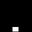
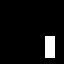
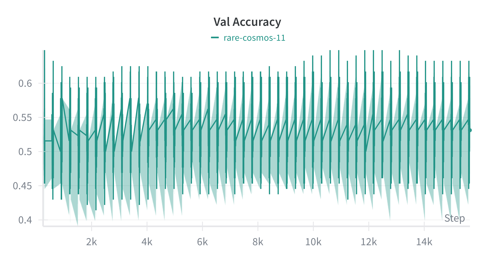
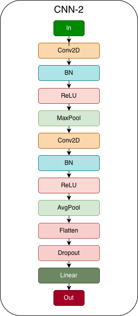
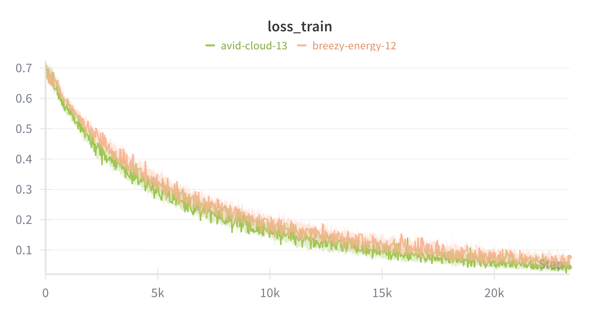
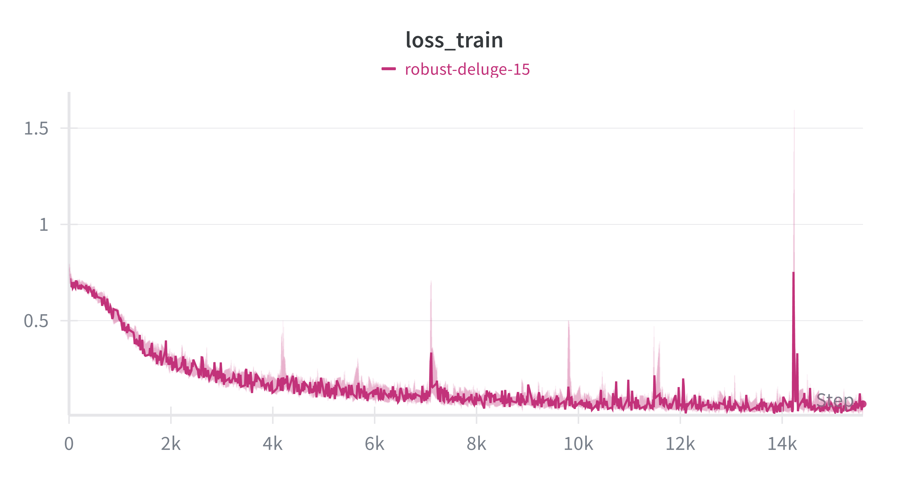
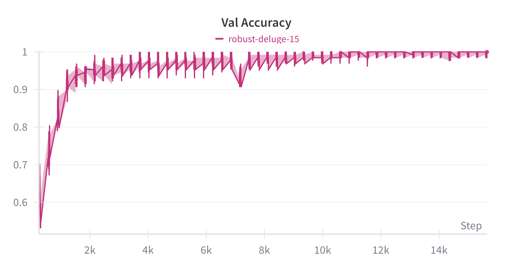

# Welcome to cnn_1

Introduction to Convolutional Neural Networks

# Findings

***Training Images looked something like this***

 <table> <tr> <td align="center">       Class 0 - Circle </td> </tr> <tr> <td align="center">         Class 1 - Rectangle</td> </tr> </table> 

Binary Cross entropy with logits loss with a CNN Resnet4 architecture, while the train Accuracy reached 90%, validation accuracy was bad. Model did not learn to classify simple Black and white images with circles or rectangles.

 <table> <tr> <td align="center">   Train Loss </td> <td align="center">   Validation Loss </td> </tr> <tr> <td align="center">   Train Accuracy </td> <td align="center">   Validation Accuracy </td> </tr> </table> 

`Possible Issues`: Model too complex, Less training data, poor regularisation stratergy. Above all, maybe the way I have designed the architecture itself is flawed. 

 <table> <tr> <td align="center">  Residual Block</td> <td align="center">   ResNet4 </td> </tr> </table> 

**Debugging**
- 
* Played with lr `1e-3` -> `1e-5`
* Played with # of ResBocks `2` -> `4`
* Played with Dropouts `0.2` - `0.5`
* Filter from `in 3` - `out 64` (Kinda knew this was an overkill)

## Fallback to Vanilla CNN

At this point, figured, either there is a bug in my code or the model is too complex, so decided to tank resnet and go with vanilla CNN. Hopefully, will pick up resnet in the future and figure out what really happened here.

 <table> <tr> <td align="center">  CNN8</td> </tr> </table> 

Got a pretty decent performance, reached Validation accuracy of 98% - 99% 

 <table> <tr> <td align="center">   Train Loss </td> <td align="center">   Validation Loss </td> </tr> <tr> <td align="center">   Train Accuracy </td> <td align="center">   Validation Accuracy </td> </tr> </table> 

**Bumped it up a notch**

Generated colored synthetic images, circles had varying radius

 <table> <tr> <td align="center">       Class 0 - Circle </td> </tr> <tr> <td align="center">         Class 1 - Rectangle</td> </tr> </table> 

 <table> <tr> <td align="center">   Train Loss </td> <td align="center">   Validation Loss </td> </tr> <tr> <td align="center">   Train Accuracy </td> <td align="center">   Validation Accuracy </td> </tr> </table> 

Decent performance, reached Validation accuracy of 98% - 99%.

**Observation**
* Images are 64x64, so circles with 1 px radius looks almost similar to a rectangle due to quantisation, or the ones that are closer to the image boundary. The softmax values for these are very close to the decision boundry or sometimes wrongly classified.

 <table> <tr> <td align="center">   Wrong Prediction </td> <td align="center">   Low Confidence Prediction </td> </tr> </table> 

