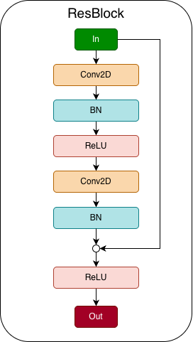
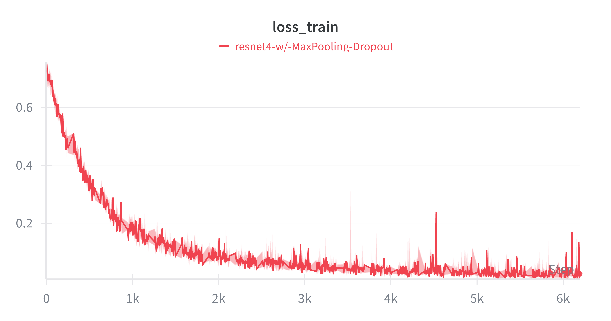
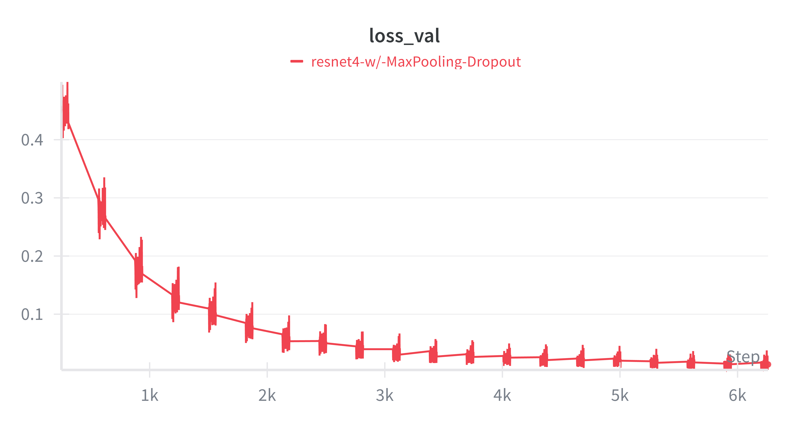
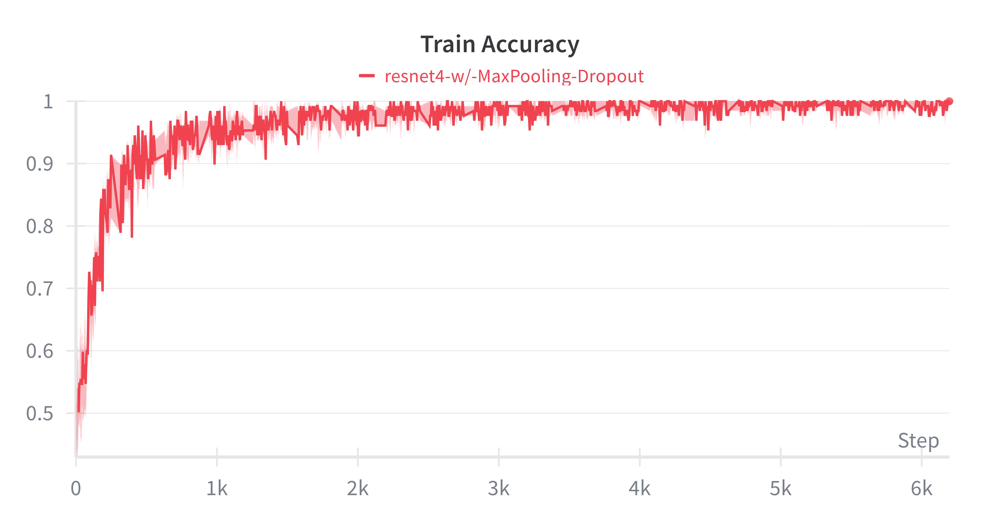
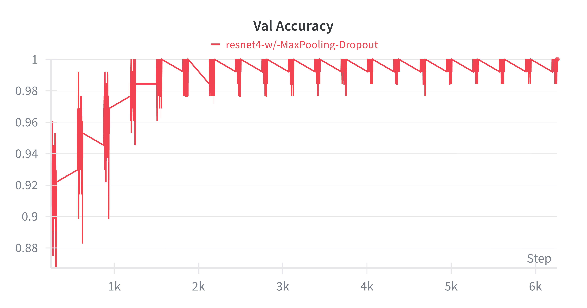
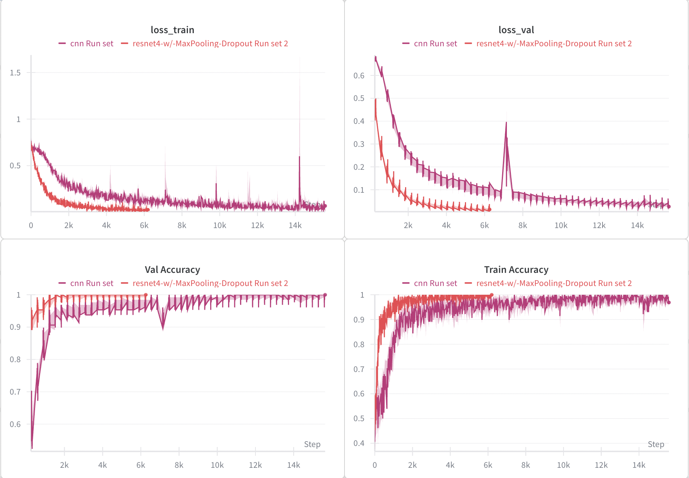
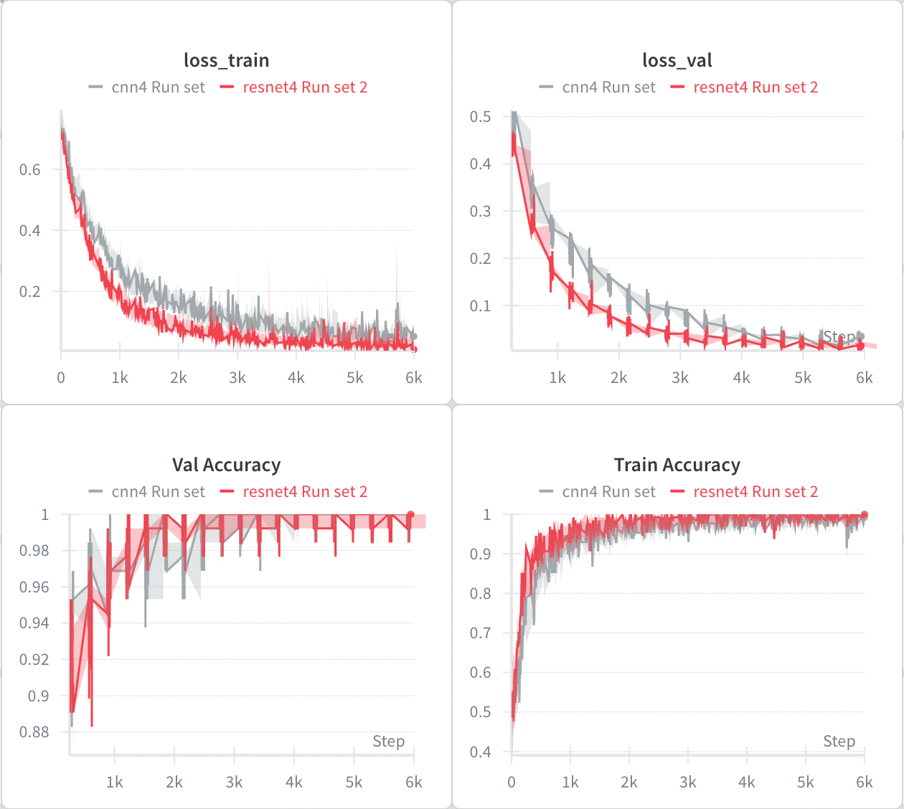

# Resnets for Binary Classification

Model is trained on the same [colored dataset](../cnn/cnn.md) as previously used in cnns, to classify the input images.

Model architecture is as shown below.

 <table> <tr> <td align="center">  Residual Block</td> <td align="center">   ResNet4 </td> </tr> </table> 

<strong>resnet4</strong>

 <table> <tr> <td align="center">   Train Loss </td> <td align="center">   Validation Loss </td> </tr> <tr> <td align="center">   Train Accuracy </td> <td align="center">   Validation Accuracy </td> </tr> </table> 

<strong>cnn v resnet4</strong>

**Observation**: The learning rate in both the trainings was set to `5e-4`. The primary difference appears to be the number of convolutional operations: ResNet-4 has more convolutions, and consequently more activations. In principle, for shallow networks, ResNets and vanilla CNNs should not differ significantly. However, we observe a substantial performance gap between the two.

**Next Steps:** Retrain CNN with the same number of convoution operations as that of the resnet4 keeping the architecture pretty much the same except the skip connection.

## Resnet4 v CNN4
As expected, the performance difference between the two shallow network architectures is not significant.

