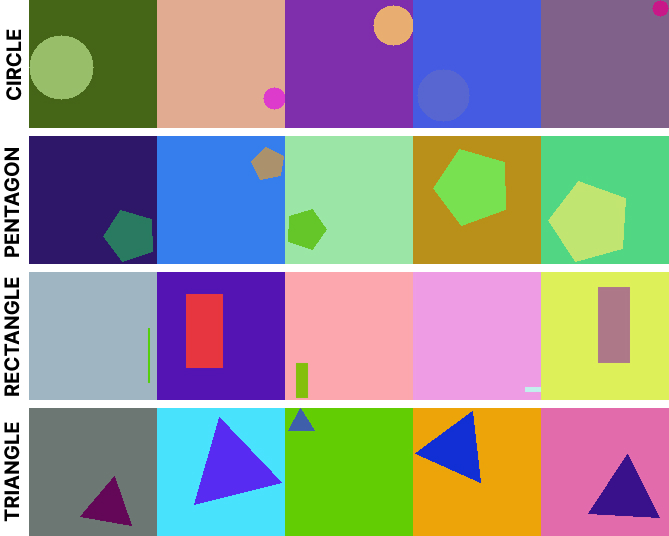
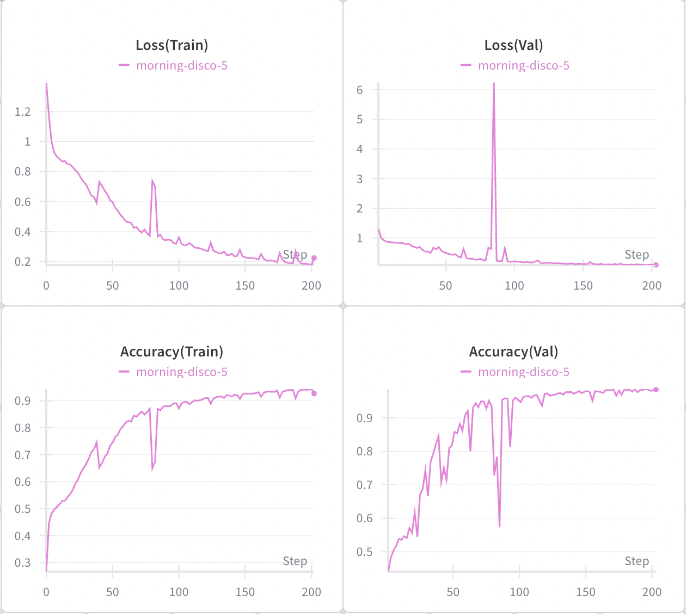

# Resnets for Multi Class Classification

Bumping it up a notch, the model is trained to classify images into 4 different class.

* Circle
* Rectangle
* Triangle
* Pentagon

As the shapes got slightly complex, it was necessary to generate images of higher resolution (128x128) such that they are visually distinict from each other. 

<strong>Dataset Sample</strong>

The output linear layer is adapted to generate four logits, rather than the single logit used in the binary classification network. Rest remains unchanged.

Loss criterion is Categorical Cross Entropy and AdamW optimizer with a `lr: 1e-3`.
As the model is trained on a CPU, the training scipt is modified to resume training from the last checkpoint.

 <table> <tr> <td align="center">  Residual Block</td> <td align="center">   ResNet4 </td> </tr> </table> 

> **Note:**
> 1. Save both the model state and the optimizer state in the checkpoint file.
> 2. To ensure that the training and validation datasets remain consistent across multiple training cycles, a fixed manual seed is passed to the random_split method and must remain unchanged.
> 3. During inference, apply softmax to the logits and select the class with the highest probability as the predicted class.
> 4. A Weights & Biases (wandb) run ID must be passed during initialization to prevent wandb from creating a new logging instance each time training is resumed.

## Results

<strong>Resnet4 Muticlass Classification</strong>

Note: The large spikes in the graph is due to incorrect checkpoint loading. Please ignore it.

### Changelog

    Additional info on notable changes done to improve code quality and software flow.
 Added
- Multi-class classification support with four output logits.
- Checkpoint saving for both model and optimizer states.

 Changed
- Output layer updated from binary to four-class classification.
- Dataset splitting now uses a fixed manual seed for reproducibility.

 Fixed
- wandb run duplication when resuming training.